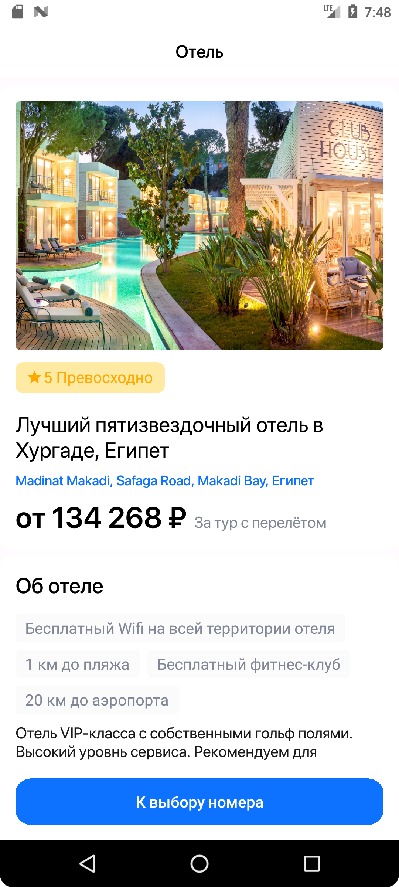

# HotelBookingApp

### Тестовое задание на позицию Junior Android разработчик

#### Стек

- Kotlin
- Clean Architecture
- MVVM + UDF
- AdapterDelegates + DiffUtils
- View binding
- Coroutine + Flow
- Cicerone
- Koin
- Room
- Retrofit
- Gson

Приложение разделено на модули:

- app - di, навигация
- data - модуль для работы с сетью
- features
    - hotel - экран с информацией об отеле
    - room - экран выбора номеров
    - booking - экран с деталями о туре и полями для данных путешественников
    - payment - экран-подтверждение заказа
- utils - модуль для настройки recyclerView и viewPager2

#### Приложение для бронирования отелей

  Приложение позволяет получить данные об отелях и номерах. Выбрав тур и заполнив данные путешественноков, пользователь может забронировать поездку.

  
    
    
    
    

#### Backlog
- Добавить индикацию на ViewPager.
- Навесить на кнопку оплаты валидацию полей ввода данных.
- Добавить кэширование данных.
